<div align="center">
    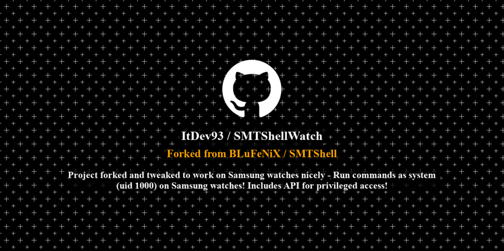
</div>

```diff
- As of April 2023 Security Patch - this exploit does not work anymore...
```

## My Contribution to this project is making the app ui watch friendly...
### This will not work on phones, only Samsung WearOS Watches (Watch4 and newer)
Features of the watch application:
1. Manifest having `uses-feature` hardware watch will prevent this app from being installed on phone...
2. All activities will keep screen on, the timeout and idle behavior of the watch makes the app hard to use...
3. Added dependancy `androidx.wear`, this is the key to making all layout contents fit in the round watch...
4. Changed ListView for buttons interface into WearableRecyclerView...
5. Binded Rotatry Iput, so now you can either scroll as a touch or rotate bezel...
6. Shell Activity input, since the watch input covers the interface, the keyboard will autoclose after every command you run allowing you to see results... 
7. Package name changed, added watch in its name...
8. At first activity if SMT is not granted access, README and shizuku links both are visible, README will open on phone, as for shizuku, if shizuku app is installed on watch it will open, else open website on phone...

Main GitHub Repo:
https://github.com/BLuFeNiX/SMTShell

---
### SMTShell
This tool allows most Samsung devices to achieve a `system` shell (UID 1000). It was patched in OneUI 5.1, but will work on Android 13 running OneUI 5.0 or older. It should work as far back and Android 9.0 (and maybe earlier).

It also acts similar to Magisk or SuperSU, allowing apps to easily execute `system` commands via [SMTShell-API](https://github.com/BLuFeNiX/SMTShell-API/).

<div align="center">
    
    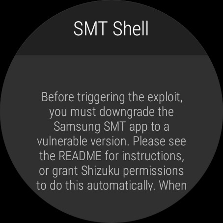
    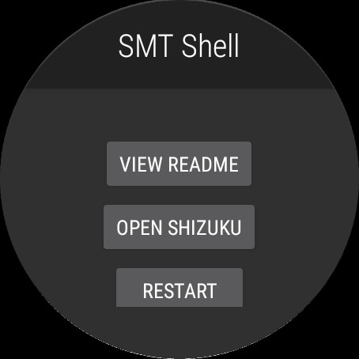 
    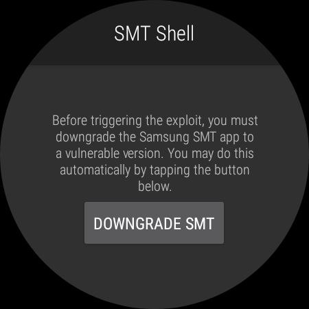 
    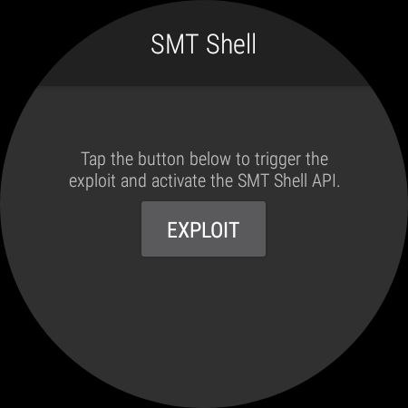
    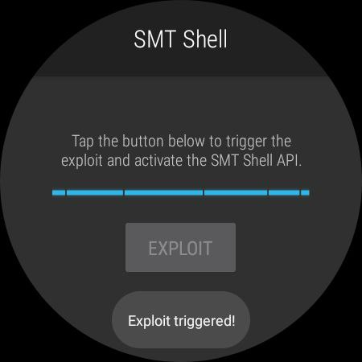 
    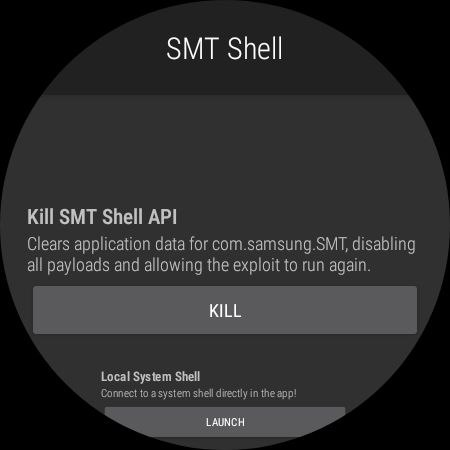 
    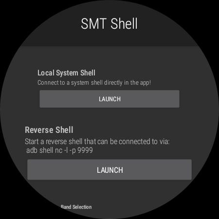
    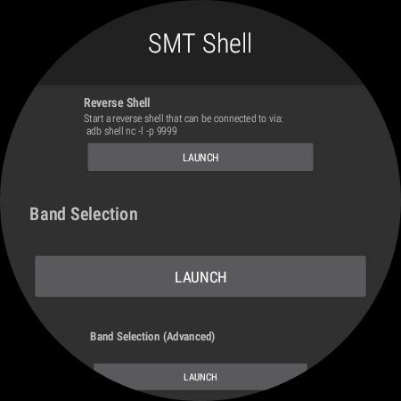 
    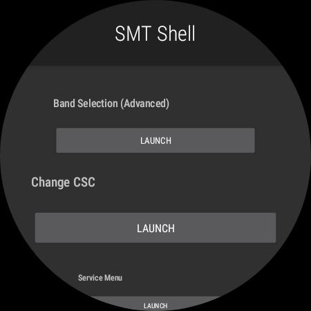 
    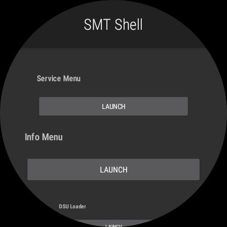
    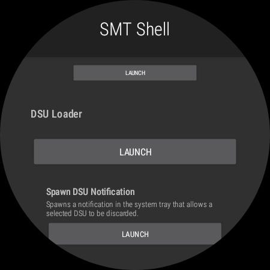 
    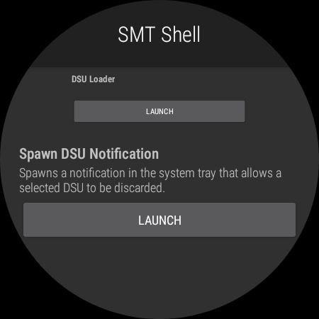 
    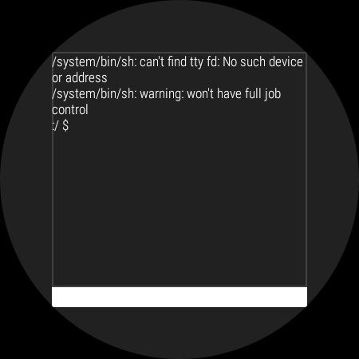 
</div>

## How to Downgrade SMT
### Usage (with Shizuku)
<a href="http://www.youtube.com/watch?feature=player_embedded&v=3gq3B2aH7-8
" target="_blank"></a>
Simply run the app and grant Shizuku access.

### Usage (no Shizuku)
1. Downgrade the TTS app to [the version provided](https://raw.githubusercontent.com/BLuFeNiX/SMTShell/master/smtshell/app/src/main/assets/com.samsung.SMT_v3.0.02.2.apk) (this must be done after every reboot):
```
adb install -d com.samsung.SMT_v3.0.02.2.apk
```
Alternatively, you can use `pm install -d /data/local/tmp/com.samsung.SMT_v3.0.02.2.apk` if you copy the file to your device first, via `adb push`

2. Install and open the SMT Shell app, and follow the prompts.

---

### Licences & Origin
This project started as a fork of [SMT-CVE-2019-16253](https://github.com/flankerhqd/vendor-android-cves/tree/master/SMT-CVE-2019-16253), created by flankerhqd (AKA flanker017). There is also a write-up by flanker [here](https://blog.flanker017.me/text-to-speech-speaks-pwned). Due to the original repo containing multiple unrelated projects, this fork's git history was rewritten using `git filter-repo` so that it only contains the relevant code (and no prebuilt artifacts).

This repo will continue to use the LGPL license that the original used when this fork was created. Other embedded components are licensed as follows:

#### Shizuku - Copyright (c) 2021 RikkaW
Some code was copied or adapted from the [Shizuku API](https://github.com/RikkaApps/Shizuku-API) demo project, which is distributed under the MIT License. Primarily, this includes files in `smtshell/app/src/main/java/com/samsung/SMT/lang/smtshell/shizuku`, and the hidden API class stubs in `smtshell/hidden-api-stub`. A copy of the license can be found [here](https://github.com/RikkaApps/Shizuku-API/blob/master/LICENSE).

#### Samsung
This project includes an unmodified Samsung APK, at `./smtshell/app/src/main/assets/com.samsung.SMT_v3.0.02.2.apk`.

#### Changes from the original
Please see the git commit history for a comprehensive list of changes. Essentially everything was changed, and only the original exploit research remains in spirit.
